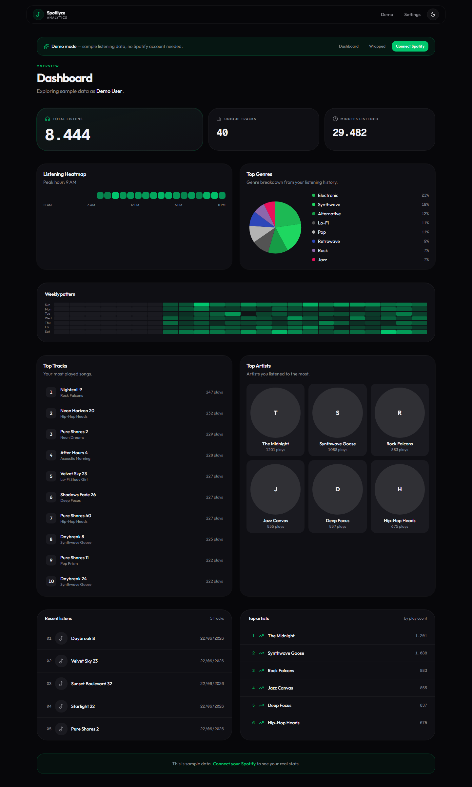
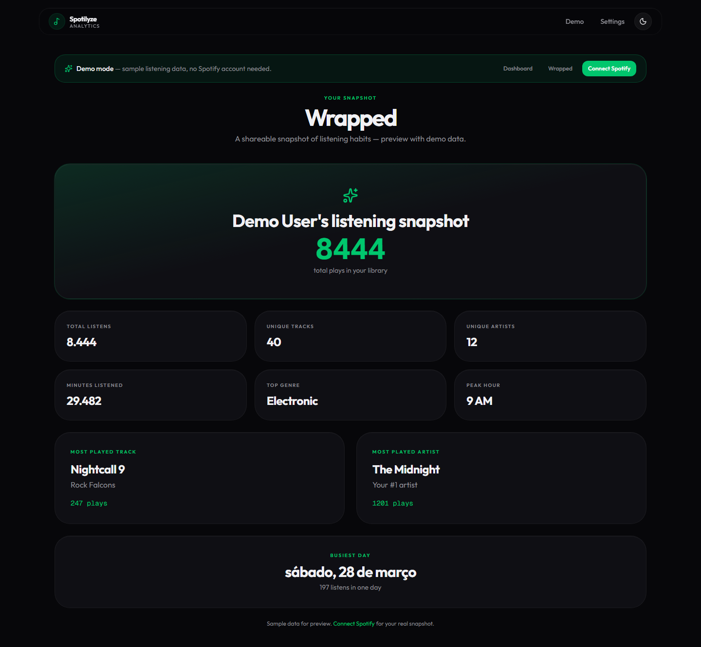

# Spotilyze

[](https://github.com/GabrielCoelhoCruz/spotilyze/actions/workflows/ci.yml)
[](./LICENSE)

> Your personal Spotify listening history, visualized. Self-host in one command.

## Why

Spotify gives artists rich analytics, but listeners get almost no insight into their own habits. Spotilyze imports your personal streaming history and turns it into a clean, fast dashboard you control.

- **Privacy first**: your data lives on your machine, not a third-party server
- **No subscriptions**: run it locally or on a cheap VPS forever
- **Try before you connect**: public demo mode with sample data at `/demo/dashboard`
- **Hackable**: Next.js, TypeScript, Tailwind CSS, Drizzle ORM on SQLite

## Screenshots

| Dashboard | Wrapped |
|-----------|---------|
|  |  |

> **No account?** Visit [`/demo/dashboard`](http://127.0.0.1:3000/demo/dashboard) to explore with sample data.

## Quick start

```bash
pnpm install
cp .env.example .env.local
# Fill in Spotify credentials and ENCRYPTION_KEY

pnpm db:generate
pnpm db:migrate
pnpm dev
```

Open http://127.0.0.1:3000 (use `127.0.0.1`, not `localhost`, for Spotify OAuth).

### Try demo (no Spotify account)

```bash
pnpm dev
# Open http://127.0.0.1:3000/demo/dashboard
```

## Self-host with Docker

```bash
cp .env.example .env
# Edit .env with your credentials

docker compose up --build
```

See [DEPLOY.md](./DEPLOY.md) for Vercel, Railway, cron setup, and production notes.

## Features

- Spotify OAuth login with encrypted token storage
- **Public demo mode** — explore the dashboard without logging in
- Dashboard with real charts: genres, hourly heatmap, top tracks & artists
- Wrapped snapshot view (`/wrapped`)
- Manual and automatic sync (cron via `/api/cron/sync`)
- CSV export of listening history
- PNG export of dashboard view
- Dark mode
- Dockerized deployment with persistent SQLite volume

## Environment

| Variable | Required | Description |
|----------|----------|-------------|
| `SPOTIFY_CLIENT_ID` | Yes | Spotify app client ID |
| `SPOTIFY_CLIENT_SECRET` | Yes | Spotify app client secret |
| `SPOTIFY_REDIRECT_URI` | Yes | OAuth callback URL |
| `ENCRYPTION_KEY` | Yes | 32-byte hex key |
| `CRON_SECRET` | No | Bearer token for automatic sync |
| `NEXT_PUBLIC_SITE_URL` | No | Public URL for OG meta tags |

## Scripts

```bash
pnpm dev          # Development server
pnpm build        # Production build
pnpm lint         # ESLint
pnpm typecheck    # TypeScript check
pnpm test         # Vitest
pnpm db:migrate   # Apply database migrations
```

## Roadmap

- [x] Spotify OAuth login
- [x] Dashboard charts with real data
- [x] Wrapped snapshot view
- [x] Public demo mode
- [x] Automatic sync (cron)
- [x] CSV/PNG export
- [x] Dark mode
- [x] Upload extended Spotify streaming history JSON
- [ ] Full-year Wrapped with historical import

## Contributing

See [CONTRIBUTING.md](./CONTRIBUTING.md) for development setup, code style, and PR guidelines.

## License

[MIT](./LICENSE)
